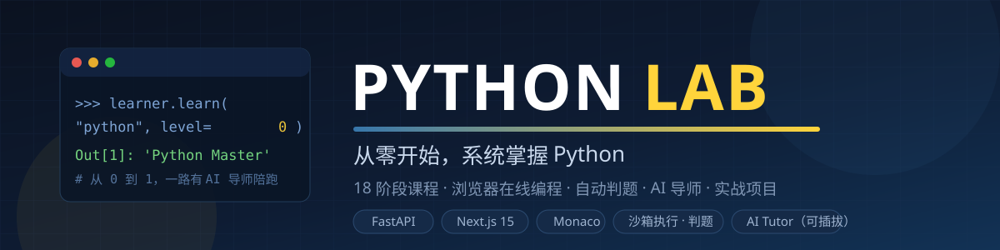
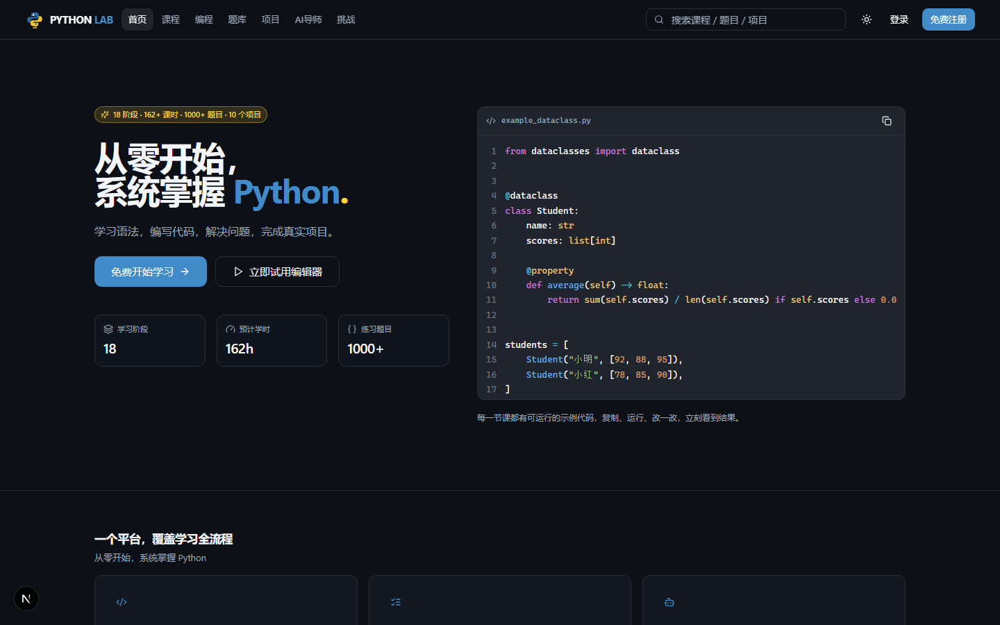
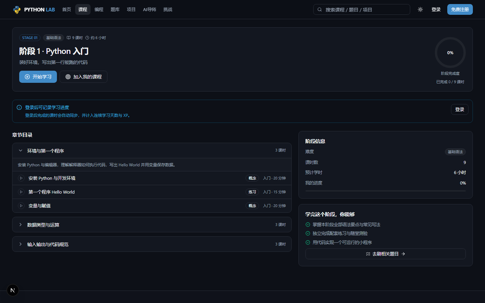

<div align="center">



# PYTHON LAB

**从零开始，系统掌握 Python —— 课程 · 在线编程 · 自动判题 · AI 导师 · 实战项目**

一个可以真正天天使用的 Python 学习操作系统：浏览器里写 Python、提交代码自动判分、AI 导师逐步引导、错题自动进错题本、XP 等级成就一路陪伴。

[](https://www.python.org)
[](https://fastapi.tiangolo.com)
[](https://nextjs.org)
[](https://react.dev)
[](#-测试与安全)
[](LICENSE)

</div>

## ✨ 它能做什么

| | 模块 | 说明 |
|---|---|---|
| 📚 | **系统课程** | 18 阶段 · 54 章节 · 162 课时：从变量到 AI Agent，每课时含理论 / 代码 / 示例 / 练习 / 常见错误 |
| ⌨️ | **在线编程** | Monaco 编辑器 + 多文件项目，`Ctrl+Enter` 直接运行，浏览器里写真的 Python |
| ⚖️ | **自动判题** | 38 道题 · 7 种题型 · 4 档难度；独立沙箱执行，逐测试点反馈 AC / WA / RE / TLE / MLE |
| 🤖 | **AI 导师** | 五级提示递进（提示→思路→局部→错误分析→详解）；练习模式服务端强制不给完整答案；无 Key 自动降级为离线规则导师 |
| 🧠 | **错题本 & 掌握度** | 答错自动收集、答对自动结清；每个知识点都有动态掌握度 |
| 🏆 | **游戏化** | XP · 7 级等级 · 26 个成就 · 每日任务 · 挑战赛 · 连续学习天数 |
| 📊 | **统计 & 考试** | 学习看板、活跃度热力图、能力雷达、5 套阶段模拟考试 |
| 🛠️ | **Admin 后台** | 课程 / 题库 / 用户 / 公告 / AI 配置全量管理，敏感密钥脱敏 + 审计日志 |

## 🖼️ 界面预览

| 首页 | 课程详情 |
| --- | --- |
|  |  |

## 🚀 快速开始

> 环境要求：Python 3.12+ 和 Node.js 18+（二选一路径均可）

**方式 A · Docker 一键启动（推荐服务器）**

```bash
cp .env.example .env          # 按需修改密钥
docker compose up -d --build  # 前端+后端+数据库+缓存+沙箱
# 打开 http://localhost:3000
```

**方式 B · 本机直接跑（推荐开发/体验）**

```bash
# 1) 后端
cd backend
python -m venv .venv && .venv/Scripts/activate     # Windows；macOS/Linux 用 source .venv/bin/activate
pip install -r requirements.txt
alembic upgrade head
python scripts/seed.py                             # 灌入 18 阶段课程 + 题库 + 成就等种子数据
uvicorn app.main:app --port 8000

# 2) 前端（另开一个终端）
cd frontend
npm install
npm run dev
# 打开 http://localhost:3000
```

**默认管理员**：`admin@pythonlab.dev` / `Admin@12345`（由 `ADMIN_*` 环境变量控制，请在生产环境修改）

## 🏗️ 架构一览

```text
浏览器 (Next.js 15 + Monaco Editor)
        │ REST / JWT (access + refresh)
        ▼
FastAPI 后端 ──► SQLite（默认） / PostgreSQL
        │            缓存：进程内 / Redis（自动降级）
        ├──► 独立 Python 沙箱服务（超时 / 内存 / 危险操作拦截，本机自动降级为受限本地执行器）
        └──► AI Provider（OpenAI 兼容 / DeepSeek / Claude / Gemini 可插拔，无 Key 降级离线规则引擎）
```

- **五档自动降级**：数据库、缓存、队列、沙箱、AI 均支持 auto 探测 + 优雅降级，本机零依赖即可跑通全流程（`GET /api/health/deps` 实时可观测）
- **安全设计**：bcrypt 加盐哈希、越权拦截、隐藏测试点不泄露、AI 密钥全链路脱敏、沙箱拦截 `os.system` / 敏感路径读取 / fork 类攻击

## 🧪 测试与安全

| 项 | 结果 |
| --- | --- |
| 后端测试（API / 判题 / AI / 权限） | **97 passed** |
| 沙箱安全用例（死循环 / 命令执行 / 敏感路径 / 输出爆炸） | **6/6 拦截 + 12 项单测** |
| 安全红线探测（密码哈希 / 越权 / 泄露 / SQL 注入） | **9/9 通过**（`backend/scripts/security_probe.py` 可复跑） |
| 安全深测第二轮（XSS / CORS / CSRF / 安全响应头） | **11/11 通过**（`backend/scripts/security_probe_round2.py` 可复跑） |
| 前端 | `tsc` 零错误 · `next build` 通过 · 31 个页面 |

## 📚 文档

| 文档 | 内容 |
| --- | --- |
| [docs/ARCHITECTURE.md](docs/ARCHITECTURE.md) | 系统架构、目录职责、降级策略、任务分解 |
| [docs/DATABASE.md](docs/DATABASE.md) | 42 张表字段级设计 |
| [docs/API.md](docs/API.md) | 全量 API 契约 + 实挂对照附录 |
| [docs/SANDBOX.md](docs/SANDBOX.md) | 沙箱协议、限制策略、Windows 降级说明 |
| [docs/AI.md](docs/AI.md) | AI Provider 接入（DeepSeek / 通义 / 智谱 / OpenAI / Claude / Gemini） |
| [docs/DEPLOYMENT.md](docs/DEPLOYMENT.md) | 部署手册（开发 / Docker / 生产） |
| [docs/SECURITY.md](docs/SECURITY.md) | 安全基线：两轮探测结论、静态审计佐证、上线前核对清单 |

## 🗺️ Roadmap

- [ ] 浏览器内跑 Pyodide（免登录试玩代码）
- [ ] AI 生成课程 / 题目 / 学习计划
- [ ] 社区题解与讨论区
- [ ] 移动端 PWA

## 📄 License

[MIT](LICENSE) © 2026 xuanguang2025-glitch
