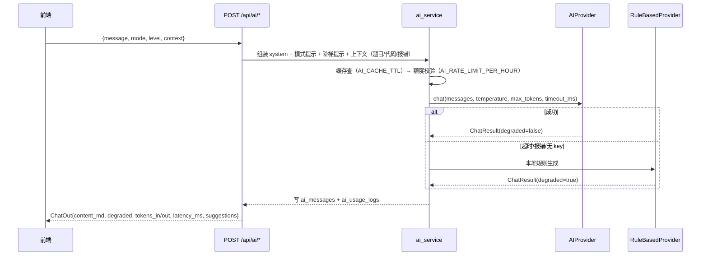

# PYTHON LAB —— AI Provider 接入与提示词规范

> 实现位置：`backend/app/ai/`（provider 工厂、OpenAI 兼容客户端、RuleBasedProvider）
> 提示词：`ai/prompts/*.md`；模型清单：`ai/config/models.yaml`

---

## 0. 一句话说明

所有厂商都通过 **OpenAI 兼容的 `/chat/completions`** 调用（DeepSeek / 通义 / 智谱 /
Gemini / Claude 兼容层），因此只需四项配置：`AI_PROVIDER`、`AI_MODEL`、
`AI_BASE_URL`、`AI_API_KEY`。

**没有任何 Key 也能用**：`AI_API_KEY` 留空（或 `AI_OFFLINE=true`）时自动切到
`RuleBasedProvider`，本地规则生成提示/点评/报错分析，响应携带 `degraded=true`，
前端显示「离线助手」徽章 —— 功能不中断。

---

## 1. Provider 接口契约

```python
# backend/app/ai/provider.py
class AIProvider(Protocol):
    name: str
    model: str
    degraded: bool

    def chat(self, *, messages: list[ChatMessage], temperature: float,
             max_tokens: int, timeout_ms: int, response_format: str | None = None) -> ChatResult: ...
    def is_available(self) -> bool: ...
    def health(self) -> dict: ...
```

`ChatResult`：

```python
@dataclass
class ChatResult:
    content: str            # 纯文本或 JSON 字符串
    tokens_in: int = 0
    tokens_out: int = 0
    latency_ms: int = 0
    model: str = ""
    provider: str = ""
    degraded: bool = False  # True = 本地规则降级
    finish_reason: str = "stop"
    error: str | None = None
```

命名：`OpenAICompatibleProvider`（真实调用）、`RuleBasedProvider`（离线降级）、
`ProviderFactory.create(settings)`（按配置选型 + 失败回落）。

---

## 2. 配置项（`.env`）

| 变量 | 默认 | 说明 |
|---|---|---|
| `AI_PROVIDER` | `deepseek` | `deepseek` / `openai` / `qwen` / `zhipu` / `anthropic` / `gemini` / `custom` |
| `AI_MODEL` | `deepseek-chat` | 模型名，随 provider 变化 |
| `AI_BASE_URL` | `https://api.deepseek.com/v1` | **必须以 `/v1` 结尾**（OpenAI 兼容路径） |
| `AI_API_KEY` | 空 | 留空 → 离线规则助手 |
| `AI_TEMPERATURE` | `0.3` | 教学场景偏低更稳定 |
| `AI_MAX_TOKENS` | `2048` | 单次生成上限 |
| `AI_TIMEOUT_MS` | `30000` | 超时 → 降级规则助手 |
| `AI_OFFLINE` | `false` | `true` = 强制离线（不发起任何外网请求） |
| `AI_RATE_LIMIT_PER_HOUR` | `60` | 每用户每小时配额，超出 429 `AI_RATE_LIMITED` |
| `AI_CACHE_TTL` | `600` | 相同请求命中缓存不耗额度 |
| `AI_DEFAULT_MODE` | `standard` | `beginner` / `standard` / `advanced` |
| `AI_ALLOW_FULL_ANSWER_IN_DRILL` | `false` | 练习模式是否允许直接给完整答案 |

厂商专用 Key（`AI_API_KEY` 为空时才读）：`DEEPSEEK_API_KEY`、`OPENAI_API_KEY`、
`QWEN_API_KEY`、`ZHIPU_API_KEY`、`ANTHROPIC_API_KEY`、`GEMINI_API_KEY`。

**密钥纪律**：key 只从环境变量读取，**永不**写入数据库、日志、响应或前端；
`/admin/models/{id}/test` 只回显 `{ok, latency_ms, error?}`，绝不回显 key。

---

## 3. 各厂商接法

### 3.1 DeepSeek（默认，最省成本）

```ini
AI_PROVIDER=deepseek
AI_MODEL=deepseek-chat          # 或 deepseek-reasoner（推理更强、更慢更贵）
AI_BASE_URL=https://api.deepseek.com/v1
AI_API_KEY=sk-xxxxxxxx
```

申请：<https://platform.deepseek.com> → API Keys。OpenAI 兼容，直接可用。

### 3.2 通义千问（阿里云 DashScope 兼容模式）

```ini
AI_PROVIDER=qwen
AI_MODEL=qwen-plus              # 或 qwen-turbo（快）/ qwen-max（强）
AI_BASE_URL=https://dashscope.aliyuncs.com/compatible-mode/v1
AI_API_KEY=sk-xxxxxxxx
```

注意：必须用 `compatible-mode/v1` 这个路径才是 OpenAI 兼容端点。

### 3.3 智谱 GLM

```ini
AI_PROVIDER=zhipu
AI_MODEL=glm-4-flash            # 或 glm-4-plus
AI_BASE_URL=https://open.bigmodel.cn/api/paas/v4
AI_API_KEY=xxxxxxxx.xxxxxxxx
```

### 3.4 OpenAI

```ini
AI_PROVIDER=openai
AI_MODEL=gpt-4o-mini            # 或 gpt-4o
AI_BASE_URL=https://api.openai.com/v1
AI_API_KEY=sk-xxxxxxxx
```

> 中国大陆访问需要自备网络代理；测试连通性用 `POST /admin/models/{id}/test`。
> 也可把 `AI_BASE_URL` 指向任何 OpenAI 兼容中转（`AI_PROVIDER=custom`）。

### 3.5 Google Gemini（OpenAI 兼容端点）

```ini
AI_PROVIDER=gemini
AI_MODEL=gemini-1.5-flash
AI_BASE_URL=https://generativelanguage.googleapis.com/v1beta/openai
AI_API_KEY=xxxxxxxx
```

### 3.6 Anthropic Claude（兼容层）

Anthropic 原生是 `/v1/messages` 协议，**不是** OpenAI 格式。两条路线：

**A. 走兼容/代理层**（推荐，代码零改动）

```ini
AI_PROVIDER=anthropic
AI_MODEL=claude-3-5-sonnet-latest
AI_BASE_URL=https://<你的兼容网关>/v1     # 例如自建 one-api / claude-openai-proxy
AI_API_KEY=sk-xxxxxxxx
```

**B. 直连原生协议**（需在 `AnthropicProvider` 里做字段映射）

| OpenAI 字段 | Anthropic 字段 |
|---|---|
| `messages[{role:system}]` | 顶层 `system` 字符串 |
| `messages[{role:user/assistant}]` | `messages[{role:user/assistant}]` |
| `max_tokens` | `max_tokens`（必填） |
| `temperature` | `temperature` |
| 响应 `choices[0].message.content` | `content[0].text` |
| 用量 `usage.prompt_tokens/completion_tokens` | `usage.input_tokens/output_tokens` |

若走 B 路线，请新增 `backend/app/ai/anthropic_provider.py`，让
`ProviderFactory` 在 `AI_PROVIDER=anthropic-native` 时选用；其余业务代码无需改动
（都依赖 `AIProvider` 协议）。

### 3.7 自建/中转（one-api、LiteLLM 等）

```ini
AI_PROVIDER=custom
AI_MODEL=任意网关内的模型名
AI_BASE_URL=https://gateway.example.com/v1
AI_API_KEY=sk-xxxxxxxx
```

此时 `ProxyChat` 只依赖 OpenAI 兼容协议，无需额外适配。

---

## 4. 无 Key 时的离线降级（RuleBasedProvider）

触发条件（任一）：`AI_API_KEY` 为空、`AI_OFFLINE=true`、模型调用超时/网络错误、
连续失败达到阈值（熔断 60s）。

能力与边界：

| 场景 | 离线行为 |
|---|---|
| `/ai/chat`（提示/思路/讲解） | 按 `level` 与代码特征输出模板化引导语（如「先确认输入是几个数」「用 `input().split()` 拆分」），`suggestions` 给出下一步可点选项 |
| `/ai/review` | 静态规则检查：可变默认参数、裸 `except`、`==` 比较 None、未使用变量、缩进/命名风格；输出结构化 `issues[]` |
| `/ai/analyze-error` | 正则识别常见异常（`NameError` / `IndexError` / `TypeError` / `ZeroDivisionError` / `KeyError` / `IndentationError`），给出成因与修复步骤、最小复现 |
| `/ai/conversations` 等历史接口 | 正常读写数据库（不依赖模型） |
| `/ai/status` | `{provider:"rule_based", model:"offline", degraded:true, remaining_quota:N, modes:[...]}` |

**必须在 UI 上明示降级**：`degraded=true` 时消息卡片显示「离线助手」徽章，
避免用户误以为得到了模型级答案。

---

## 5. 调用链与兜底



**约束**：调用必须有超时（`AI_TIMEOUT_MS`）；`POST /api/ai/*` 走
`run_in_threadpool` 包装，避免阻塞事件循环；单次请求只允许有限重试（≤1 次），
并且**必须**能回落到 `RuleBasedProvider`。

---

## 6. 提示词规范（`ai/prompts/`）

| 文件 | 用途 | 关键约束 |
|---|---|---|
| `tutor_system.md` | 导师身份与总则 | 中文、鼓励式、**不直接给完整答案**（除非 `level=full` 或 `AI_ALLOW_FULL_ANSWER_IN_DRILL=true`） |
| `hint_ladder.md` | 五级提示阶梯 | `hint` / `approach` / `partial` / `full` / `explain` 逐级加量 |
| `code_review.md` | 代码点评 | 输出严格 JSON：`{score, summary_md, issues[{severity,line,title,suggestion}], improved_code}` |
| `error_analysis.md` | 报错分析 | 输出严格 JSON：`{error_type, cause, location, fix_steps[], minimal_example, related_topics[]}` |
| `mode_beginner.md` | 初学者模式 | 生活类比 + 一步一动，禁止术语堆砌 |
| `mode_standard.md` | 标准模式 | 概念 + 代码 + 练习 |
| `mode_advanced.md` | 进阶模式 | 复杂度、惯用法（Pythonic）、边界与性能 |
| `exam_generator.md` | 组卷 | 按知识点与难度分布出题，附解析 |

通用要求：全部使用简体中文；Markdown 输出；代码块标注语言；
**不编造 Python 不存在的 API**；题目上下文不足时先反问一句再给提示。

---

## 7. 验证清单

```bash
# 1) 看当前 provider 与降级状态
curl -s http://127.0.0.1:8000/api/ai/status -H "Authorization: Bearer <token>"

# 2) 管理端连通性测试（不回显 key）
curl -s -X POST http://127.0.0.1:8000/api/admin/models/<id>/test -H "Authorization: Bearer <admin>"

# 3) 无 Key 场景：把 AI_API_KEY 置空后重启，确认
#    /ai/chat 返回 degraded=true 且 content_md 非空

# 4) 额度：连续超过 AI_RATE_LIMIT_PER_HOUR 后应返回 429 AI_RATE_LIMITED
```

| 检查项 | 期望 |
|---|---|
| 无 `AI_API_KEY` | 服务正常启动，AI 接口返回 `degraded=true`，不报 5xx |
| `AI_OFFLINE=true` | 不发起任何外网请求（可断网验证） |
| Base URL 写错 | `degraded=true` + 日志记录原因，前端仍有内容 |
| 超时 | `AI_TIMEOUT_MS` 后回落规则助手，不无限等待 |
| 密钥泄漏检查 | 日志/响应/前端 bundle 中搜不到 `sk-` |
