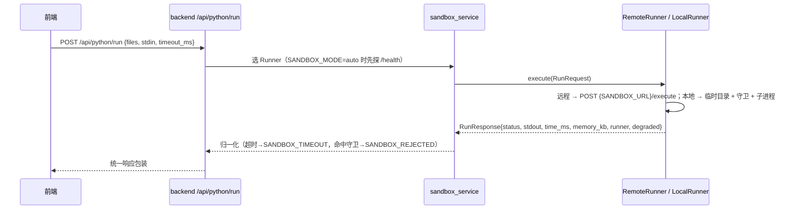

# PYTHON LAB —— 沙箱协议与安全边界

> 权威协议定义：`docs/ARCHITECTURE.md` §5；实现：`sandbox/`（独立服务）与
> `backend/app/sandbox/local_runner.py`（降级）。

---

## 0. 结论先行（安全声明）

> **本地 Runner 不是安全边界。** `LocalRunner` 与 `sandbox/` 在本机（尤其
> Windows）运行时只提供「尽力而为」的限制：超时 kill、输出截断、禁用危险内建、
> 路径白名单、导入黑名单。
>
> - **开发/离线演示**：可接受，UI 上以徽章提示「本地执行（非隔离）」。
> - **生产环境**：**必须**使用容器化沙箱（`sandbox` 服务 + 容器加固），并把
>   沙箱放在 backend 才能访问的独立网络里。仅靠进程内的守卫脚本**不足以**
>   隔离恶意代码 —— Python 中始终存在绕过进程内自省限制的方式。
> - 绝不要把 `8081` 端口直接暴露到公网。

---

## 1. 服务接口

| Method | Path | 说明 |
|---|---|---|
| GET | `/health` | `{status, security_level, capabilities, limits, degraded}` |
| GET | `/limits` | 生效限额、导入黑名单、静态规则名 |
| POST | `/execute` | 规范入口（`mode=run\|judge`） |
| POST | `/run` | 单次运行别名 |
| POST | `/judge` | 判题别名（无 `test_cases` 时退化为单次运行） |

### 1.1 请求

```jsonc
{
  "request_id": "9f3c...",            // 必填（缺省自动生成），用于日志串联
  "language": "python",               // 目前仅 python
  "version": "3.13",                  // 可选，仅记录
  "mode": "run",                      // run | judge | batch_run
  "files": [{"path": "main.py", "content": "print(int(input())+1)"},
            {"path": "utils/helper.py", "content": "def add(a,b): return a+b"}],
  "entry": "main.py",                 // 入口文件，默认 main.py
  "stdin": "3\n",
  "test_cases": [{"id": "tc1", "input": "1\n", "expected": "2", "comparison": "trimmed"}],
  "timeout_ms": 5000,                 // 别名 timeout；服务端 clamp [1000,10000]
  "memory_limit_mb": 256,             // 别名 memory_mb；clamp [32,512]
  "cpu_limit_ms": 4000,
  "max_output_bytes": 65536,          // 超出截断并置 truncated=true
  "allow_network": false,             // 服务端配置优先，请求只能收紧不能放宽
  "env": {"PLAB_FLAG": "1"}           // 仅接受 PLAB_ 前缀，长度 ≤1024
}
```

兼容别名：`code`（等价单文件）、`files` 传对象字典、`timeout`、`memory_mb`。
响应同时给出 `time_ms`/`duration_ms` 与 `status`/`timed_out`。

### 1.2 响应

```jsonc
{
  "request_id": "9f3c...",
  "status": "success",   // success|compile_error|runtime_error|timeout|memory_exceeded|
                         // output_exceeded|security_error|wrong_answer|internal_error
  "exit_code": 0,
  "stdout": "2\n", "stderr": "",
  "truncated": false,
  "time_ms": 23, "duration_ms": 23,
  "memory_kb": 18432,
  "timed_out": false,
  "results": [{"test_case_id": "tc1", "passed": true, "actual": "2", "expected": "2",
               "time_ms": 12, "memory_kb": 16384, "status": "success", "diff": null}],
  "passed_cases": 1, "total_cases": 1,
  "error": null,                       // 或 {type, message, traceback, line}
  "runner": "sandbox",                 // backend 侧为 local 时表示降级
  "degraded": true,                    // security_level != hardened
  "security_level": "degraded"
}
```

`status` 与 backend 错误码的映射：

| status | backend 错误码 | 前端表现 |
|---|---|---|
| `timeout` | `SANDBOX_TIMEOUT` / submission `TLE` | 输出面板提示超时 |
| `security_error` | `SANDBOX_REJECTED` | 提示「代码包含禁用语法」 |
| `output_exceeded` | `OUTPUT_TOO_LARGE` | 提示输出被截断 |
| `memory_exceeded` | submission `MLE` | 提示内存超限 |
| `compile_error` / `runtime_error` | submission `CE` / `RE` | 展示 stderr |
| 服务不可达 | `SANDBOX_UNAVAILABLE` (503) | 提示维护中 |

---

## 2. 限制策略（六层）

| 层 | 位置 | 手段 | Linux | Windows |
|---|---|---|---|---|
| 1 | `security.py` | 执行前源码静态检查 | ✅ | ✅ |
| 2 | `limits.py` | 资源限额 | `setrlimit(AS/DATA/CPU/FSIZE/NPROC/NOFILE/CORE)` | psutil 轮询 RSS 超限 kill |
| 3 | `runner.py` | 墙钟超时 + 进程树 kill | `os.killpg` | `taskkill /F /T` |
| 4 | `runner.py` | 输出字节截断（默认 64KB） | ✅ | ✅ |
| 5 | `guard.py` | 子进程内运行时守卫（`-c` 注入） | ✅ | ✅ |
| 6 | `limits.py` | 网络命名空间隔离 | 探测 `unshare -n` 成功才启用 | ❌ |

### 2.1 静态检查规则（第一层）

命中即返回 `security_error`（不执行代码）：

| 规则 | 拦截内容 |
|---|---|
| `subprocess` / `multiprocessing` / `ctypes` / `pty` | 进程与系统库调用 |
| `importlib` | 动态导入、模块重载 |
| `os.system` | `os.system/popen/exec*/spawn*/fork/kill` |
| `os.remove` / `shutil.rmtree` | 删除、重命名文件 |
| `socket` / `urlopen` | 建连、HTTP 请求 |
| `sensitive_read` | `open("/etc/...")`、`open(r"C:/Windows/...")` 等敏感绝对路径（**在未剥离字符串的原始源码上匹配**，因此支持 `r"..."` 等前缀） |
| `dunder_import` / `breakpoint` | 绕过导入名单、进入调试器 |

文本形参会先剥离字符串与注释再匹配，降低误报；`sensitive_read` 例外（路径本身就是字符串）。开关：`SANDBOX_STATIC_SCAN=false` 可关闭（不推荐）。

### 2.2 运行时守卫（第五层，`guard.py`）

1. `open()`：**读**只允许「工作目录 / 系统 temp / `sys.prefix` / stdlib 目录」；
   **写**只允许工作目录；并拒绝 `passwd`、`shadow`、`win.ini`、`.ssh`、`.env` 等敏感名
2. `__import__`：黑名单（subprocess、multiprocessing、ctypes、pty、tkinter…）；
   可选白名单模式（`SANDBOX_IMPORT_MODE=whitelist` + `SANDBOX_ALLOWED_IMPORTS`）。
   默认 `blacklist`，因为教学代码常用 `numpy`/`pandas`
3. 模块属性清洗：`os.system/popen/exec*/fork/kill/remove/unlink`、`subprocess.*`、
   `socket.socket/create_connection/socketpair`；并清空这些模块的 `__spec__/__loader__`
4. `importlib.reload` / `importlib.import_module` 被禁用 —— 否则 `reload(os)`
   会重新执行 `os.py` 把 `os.system` 装回来（`runpy` 等引导流程使用 `importlib`，
   因此只禁用重载/动态导入，不禁用模块本身）
5. 递归深度上限（默认 300）、`sys.set_int_max_str_digits(5000)`
6. stdout/stderr 字节预算：超限后**静默丢弃**并写一行 stderr 提示，进程不会被误判为失败
7. `input()` 调用次数上限，避免无 stdin 时无限阻塞

守卫通过以下方式注入（`runner.py`）：

```bash
python -I -B -c "<bootstrap>" <entry_abs>
# bootstrap: 把工作目录加入 sys.path → import _plab_guard → install(...) → runpy.run_path(entry, run_name='__main__')
```

`-I` 会忽略 `PYTHONPATH`/`PYTHONHOME`/user-site，因此宿主环境变量无法影响子进程。

### 2.3 `security_level` 的含义

| 值 | 条件 | 含义 |
|---|---|---|
| `hardened` | POSIX（Linux 容器） | rlimit + 进程组隔离生效（有 `unshare` 时再加禁网） |
| `degraded` | Windows | 无 rlimit/cgroup，仅超时 kill + 轮询 RSS + 守卫 |

`/health` 与响应里的 `degraded` 字段即来源。backend 的 `/api/health/deps`
`runner.degraded` 由它决定；UI 上用徽章提示「本地执行（非隔离）」。

---

## 3. 与 backend 的衔接



降级链：`SANDBOX_MODE=auto` → 探测 `GET {SANDBOX_URL}/health`（`SANDBOX_PROBE_TIMEOUT_MS`，
默认 1500ms）→ 成功用远程；失败且 `LOCAL_RUNNER_ENABLED=true` 用本地；
都不可用返回 503 `SANDBOX_UNAVAILABLE`。

判题（`/api/submissions`）由 `judge_service` 逐用例调用 Runner，单项超时可配，
总预算 30s（`SANDBOX_JUDGE_BUDGET_MS`）；`mode=judge` 可一次请求批量返回 `results[]`。

---

## 4. 已知限制与残余风险

1. **进程内守卫可被绕过**：Python 的自省能力无法在纯 Python 层彻底封死。
   具体残余路径：`open()` 允许读 `sys.prefix` 下的标准库（为了让 traceback 能显示
   出错源码行），因此理论上可把 `os.py` 源码 `exec` 进 `os` 模块的命名空间，
   把 `os.system` 等属性重新装回来。需要多步构造、非常规代码才能做到，
   且 `importlib.reload` 已被堵死。**这正是生产必须用容器沙箱的原因。**
2. **Windows 无内存硬限制**：psutil 轮询间隔 100ms，短时内存尖峰可能超限；
   轮询到超限才 kill，存在短暂超额。
3. **`allow_network` 在无 `unshare` 的 Docker 环境里靠 socket 拦截**，
   非 socket 的 I/O（如直接 `open` 设备文件）已被路径白名单挡住，但仍建议
   容器层加 `--network none`。
4. **CPU 限额是墙钟 + rlimit(CPU)**：Windows 上仅墙钟，CPU 密集但 I/O 阻塞的
   代码不会因 CPU 时间被杀。
5. **临时目录清理**：每次执行 `mkdtemp` 后 `rmtree`；进程被外部强杀时可能残留，
   由系统临时目录清理策略回收。
6. **静态检查误报**：注释/字符串已剥离，但动态拼串仍可能绕过 →
   这正是运行时守卫存在的理由。

---

## 5. 加固建议（生产）

```yaml
# docker-compose.yml 已内置
read_only: true
tmpfs: ["/tmp:rw,noexec,nosuid,size=256m"]
cap_drop: ["ALL"]
security_opt: ["no-new-privileges:true"]
pids_limit: 256
mem_limit: 640m
cpus: "1.0"
```

额外建议：

- 把 `sandbox` 放进 `internal: true` 的独立网络（仅 backend 可达）
- 只让 sandbox 走内网，不映射 8081；需要调试时用 `docker compose exec`
- 在宿主 dotfiles 之外挂 seccomp profile（默认 `runtime/default` 已够用）
- 对 `sandbox` 服务做请求级限流（backend 已有 30 次/分钟/用户）

---

## 6. 本地自测

```bash
cd sandbox
.venv/Scripts/python -m uvicorn app.main:app --host 127.0.0.1 --port 8081
curl -s http://127.0.0.1:8081/health | python -m json.tool

curl -s -X POST http://127.0.0.1:8081/execute -H 'Content-Type: application/json' \
  -d '{"code":"print(int(input())+1)","stdin":"41\n"}'
# → {"status":"success","stdout":"42\n",...}

curl -s -X POST http://127.0.0.1:8081/run -H 'Content-Type: application/json' \
  -d '{"code":"while True: pass","timeout_ms":2000}'
# → {"status":"timeout","timed_out":true,...}

curl -s -X POST http://127.0.0.1:8081/run -H 'Content-Type: application/json' \
  -d '{"code":"import os; os.system(\"echo hacked\")"}'
# → {"status":"security_error",...}

.venv/Scripts/python -m pytest tests -q
```

| 用例 | 期望 | 说明 |
|---|---|---|
| `print("hello world")` | `success` + stdout 正确 | 基础通路 |
| `while True: pass` | `timeout`，`timed_out=true`，≤8s 返回 | 超时 kill 进程树 |
| `import os; os.system("echo hacked")` | `security_error` | 静态检查 + 守卫双重拦截 |
| `open("/etc/passwd")` / `open("C:/Windows/win.ini")` | `security_error` | 敏感路径拦截 |
| `print("A"*10**7)` | `truncated=true`，stdout ≤64KB | 输出截断 |
| `import subprocess` | `security_error` | 导入黑名单 |
| `import numpy as np; print(np.arange(5).sum())` | `success` | 教学库可用 |
